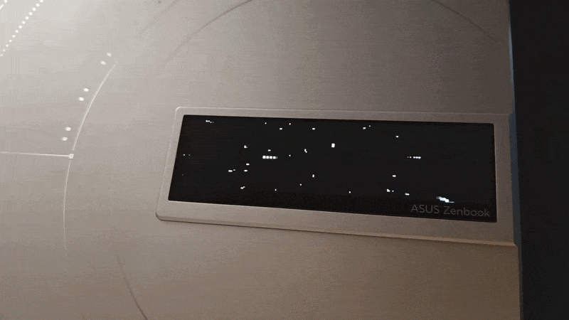
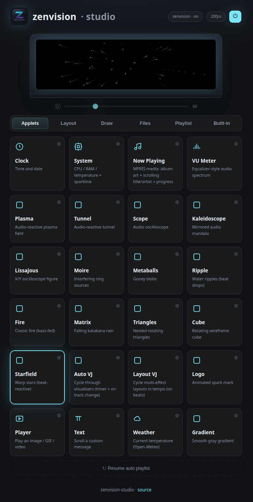
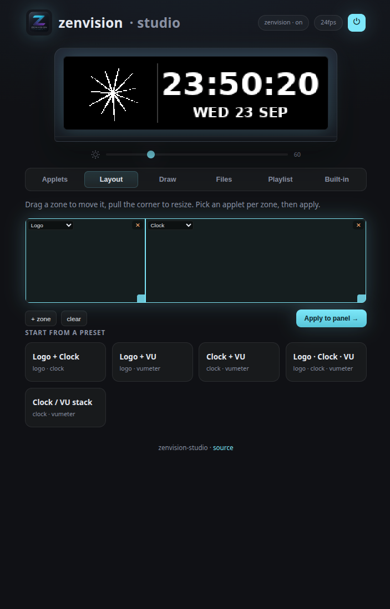
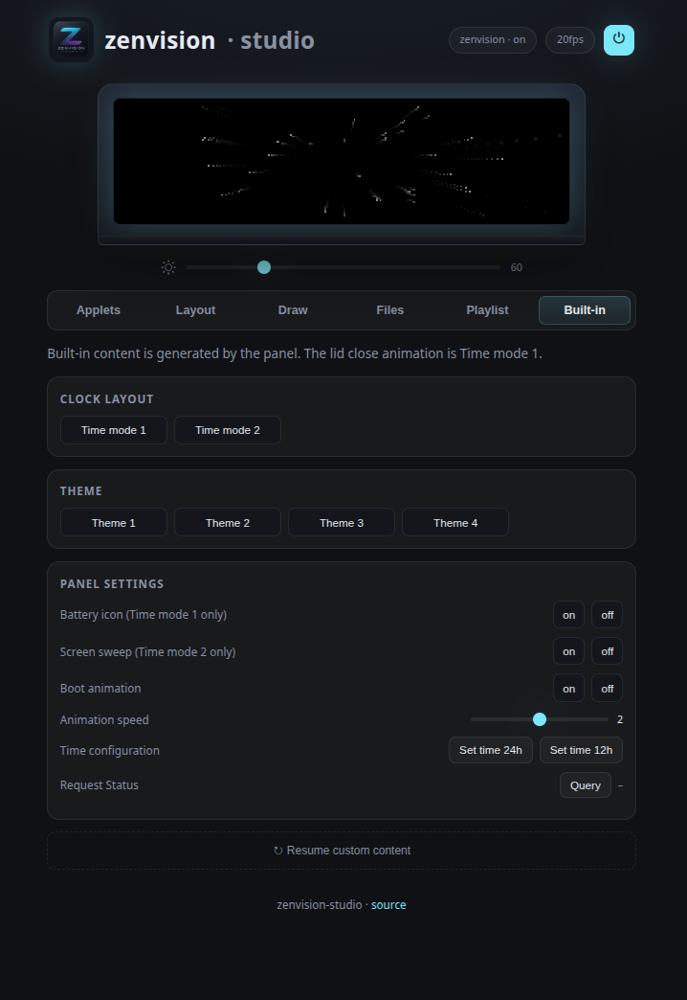
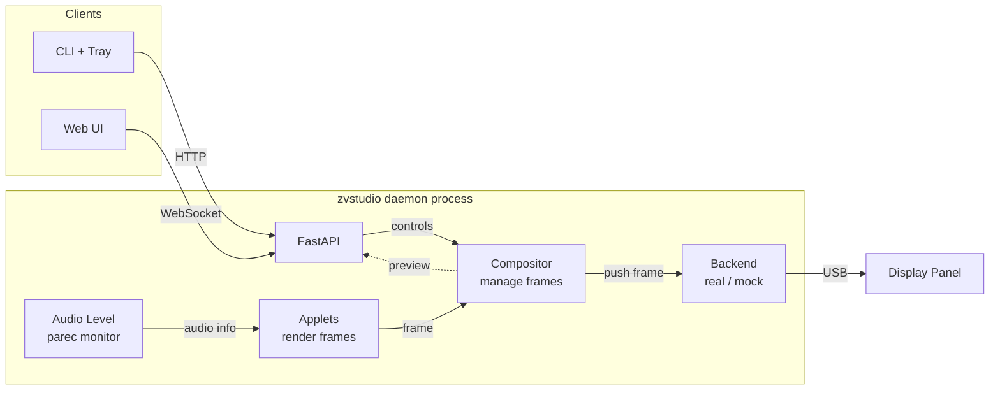

> **Fork Notice** - This project is a custom version of [zenvision-studio](https://github.com/tarpediem/zenvision-studio) by [tarpediem](https://github.com/tarpediem), focused on performance, personalization, and Kubuntu support.

# ZenVision Studio · *BaguetteJet EDITION*

ZenVision lid display controls on Linux for the ASUS Zenbook 14X Space Edition laptop.



## Introduction

The Zenbook 14X OLED Space Edition (UX5401ZAS) has a small 256×64 monochrome OLED display built into the lid. ASUS only provides MyASUS Windows software for it.

This project brings support to Linux through a daemon and web UI, featuring applets, audio-reactive visualisers, a timeline animation editor, and drag-and-drop screen layouts.

**This version** of zenvision studio combines the original [zenvision-linux](https://github.com/tarpediem/zenvision-linux) driver with additional commands discovered through my own [protocol research](https://github.com/BaguetteJet/zenvision-protocol-research), along with performance improvements and personal customizations. Packaging for Kubuntu/Ubuntu/Debian instead of Arch/CachyOS.

> [!WARNING]   
> **OLED Burn-In Risk**   
> Displaying static elements for an extended amount of time will cause permanent pixel degradation. 

## Fork Purpose

### Completed

- ✅ Optimize display process (encode/compositor)
- ✅ Optimize individual applets (render)
- ✅ Overhaul the starfield applet (my favourite)
- ✅ Fix nowplaying applet text and add album cover
- ✅ Benchmark applet rendering performance
- ✅ Start/stop audio reactive processing when required
- ✅ Make audio reactive content optional
- ✅ Correct date/time on lid close animation
- ✅ Remove beat-flash mode
- ✅ Fix frame generation and add live FPS display
- ✅ Fix brightness adjustment
- ✅ Fix configuration save
- ✅ Fix idle daemon CPU usage
- ✅ Update web UI and tray menu
- ✅ Implement built-in content, reverse-enineered through my [protocol research](https://github.com/BaguetteJet/zenvision-protocol-research)
- ✅ Package for Kubuntu/Ubuntu/Debian with `.deb` GitHub Releases, see [PACKAGING.md](docs/PACKAGING.md)

### Remaining

- Fix default animation playing briefly on suspend

## Performance

Median render cost per frame compared to the forked version of [zenvision-studio](https://github.com/tarpediem/zenvision-studio/tree/f7a48d0cef338c36d5d2d5476a6ce9539149f619), measured on the mock backend at each applet's declared fps.

### Major Improvements

- **Matrix rain applet (≈64× faster)** — glyphs rasterized once per fade level and blitted.
- **Frame encoder (≈44× faster)** — 16384-pixel 4bpp packing loop vectorized NumPy.
- **Text marquee (≈21× faster)** — text strip rendered once and cache.
- **Audio is opt-in** — analysis starts/stops on demand and is off by default.
- **Idle panel costs nothing** — loop pushes black once and sleeps instead of re-pushing constantly.
- **Compositor** — loop renders frame rate per applet instead of global rate.


## Web UI
Includes a live mirror of the panel custom content. Controls display, brightness, power, per-applet settings, layouts, animations, playlists. Include built-in themes, clock configuration and settings. Displays current fps.

|Applets | Layouts | Built-in and settings |
|---|---|---|
|  | |  |


## Features

- **Applets**: clock, system monitor, now-playing, text, weather, media player, visualizers and more.
- **Built-in themes**: control panel built-in content including clock layouts, themes, animation speed, etc.
- **Live FPS**: Web UI shows the actual frame rate for the active applet.
- **Audio-reactive visualisers**: audio analysis is opt-in and starts/stops on demand.
- **Web UI**: live mirror, per-applet settings, playlists, zone layouts, and drag-and-drop upload.
- **Easy dev**: `mock` backend renders a preview, so runs even with no device.

## Installation

### Kubuntu / Ubuntu / Debian (recommended)

Download the latest `.deb` from the [Releases](https://github.com/baguettejet/zenvision-studio/releases) page and install it:

```bash
sudo apt install ./zenvision-studio_*.deb
```

**Enable** and start the daemon:

```bash
systemctl --user enable --now zvstudio
```

The **KDE tray** auto-starts at your next login.

> Requires Python 3.10 or newer. The tray requires two system packages, which ship with **Kubuntu** by default. For Ubuntu and Debian:    
> `sudo apt install python3-gi gir1.2-ayatanaappindicator3-0.1`

See [INSTALL.md](docs/INSTALL.md) for the source install script, manual setup, and **other distributions**.

## Run

```bash
zvstudio daemon   # panel daemon + web UI on http://127.0.0.1:8787
ZVSTUDIO_BACKEND=mock zvstudio daemon   # no hardware? mock backend + live preview
```

See [CLI.md](docs/CLI.md) for details on commands.

## Architecture

Everything above the panel backend deals only in PIL grayscale images. Applets draw them, the compositor schedules them, the API mirrors them. Only `core/device/` knows the USB format.



`play`/`anim` are the exception as they skip the daemon and drive the panel backend directly.

## Credits

Originally created by [tarpediem](https://github.com/tarpediem), who created the project based on the reverse-engineered protocol documented in [zenvision-linux](https://github.com/tarpediem/zenvision-linux). This project is unofficial and is not affiliated with or endorsed by ASUS. 

This fork is maintained and updated by [BaguetteJet](https://github.com/BaguetteJet).

## License

[MIT](LICENSE)
